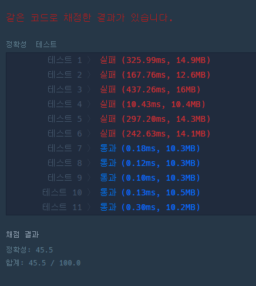

# 가장 큰 수

원문 URl : https://programmers.co.kr/learn/courses/30/lessons/42746

## 문제 설명

0 또는 양의 정수가 주어졌을 때, 정수를 이어 붙여 만들 수 있는 가장 큰 수를 알아내 주세요.

예를 들어, 주어진 정수가 [6, 10, 2]라면 [6102, 6210, 1062, 1026, 2610, 2106]를 만들 수 있고, 이중 가장 큰 수는 6210입니다.

0 또는 양의 정수가 담긴 배열 numbers가 매개변수로 주어질 때, 순서를 재배치하여 만들 수 있는 가장 큰 수를 문자열로 바꾸어 return 하도록 solution 함수를 작성해주세요.

## 제한 사항
- numbers의 길이는 1 이상 100,000 이하입니다.
- numbers의 원소는 0 이상 1,000 이하입니다.
- 정답이 너무 클 수 있으니 문자열로 바꾸어 return 합니다.

## 입출력 예

numbers	return
[6, 10, 2]	"6210"
[3, 30, 34, 5, 9]	"9534330"

|numbers|return|
|------|---|
|[6, 10, 2]|"6210"|
|[3, 30, 34, 5, 9]|"9534330"|


## Source
```python
def solution(numbers):
    answer = ''

    check_num = 9

    while check_num >= 0:
        checked_idx_dict = {idx: number for idx, number in enumerate(numbers) if str(number)[0:1] == str(check_num)}

        if checked_idx_dict:
            if len(checked_idx_dict) == 1:
                k, v = checked_idx_dict.popitem()
                answer += str(v)
                numbers.pop(k)
            else:
                transformed_checked_idx_dict = {}
                max_value_length = len(str(max(list(checked_idx_dict.values()))))
                for k, v in checked_idx_dict.items():
                    if max_value_length - len(str(v)) != 0:
                        v = str(v) + str(check_num) * (max_value_length - len(str(v)))
                        transformed_checked_idx_dict[k] = int(v)
                    else:
                        transformed_checked_idx_dict[k] = v
                transformed_checked_idx_dict = sorted(transformed_checked_idx_dict.items(), key=(lambda x: x[1]), reverse=True)

                for _idx, k_v in enumerate(transformed_checked_idx_dict):
                    answer += str(checked_idx_dict[k_v[0]])

        check_num -= 1

    if answer.startswith("0"):
        answer = "0"

    return answer
```

### description
- 리스트를 순회하며 첫번째 숫자가 9인것부터 ~ 1인것까지 차례대로 하위 루프를 수행한다
- 하위루프에서는 filtering된 리스트에서 가장 길이가 긴 값의 길이를 체크한 뒤
  나머지 값들의 길이를 맞춰준다
- 그리고 비교를 해서 answer에 값을 더해준다(str)
- 생각보다 어려운 문제였다 ㅠㅠ

### 결과
- 1 ~ 6번 테스트를 통과하지 못했다
- numbers가 [40, 404] 일 경우 답은 "40440"인데, 나의 풀이는 "40404"로 계산되어 틀렸다  


### 다른 사람들의 풀이
- 3줄로 끝내는걸 보고 현타가 왔다
- 그냥 리스트 전체를 정렬하고, 각 값을 3번 곱한다
  str 형식으로 변경 한뒤 3을 곱하면 자기자신을 3번 나열하는것이다.
- ex) "4" * 3  ==> "444"
- 왜 3번을 곱했을까 생각을 해봤는데, 제한사항에서 numbers의 값은 1000 이하 이므로
  한자리 숫자를 최대 3자리까지 만들려고 그런것 같다(?)
```python
def solution2(numbers):
    numbers = list(map(str, numbers))
    numbers.sort(key=lambda x: x * 3, reverse=True)
    return str(int(''.join(numbers)))
```

- "lambda x: x * 3" 부분이 신기해서 개인적으로 테스트한 결과를 첨부한다
```python
a = [10, 30, 34, 3, 7, 71]
b = list(map(str, a))
b
Out[4]: ['10', '30', '34', '3', '7', '71']
b.sort(key=lambda x: x*3, reverse=True)
b
['7', '71', '34', '3', '30', '10']
```