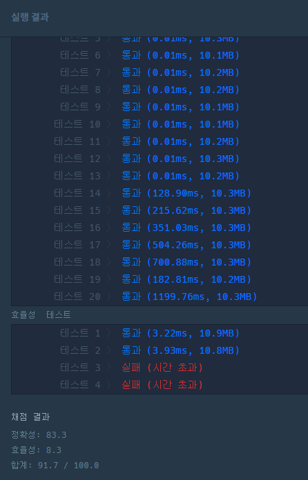

# 전화번호 목록

원문 URl : https://programmers.co.kr/learn/courses/30/lessons/42577?language=python3

전화번호부에 적힌 전화번호 중, 한 번호가 다른 번호의 접두어인 경우가 있는지 확인하려 합니다.  
전화번호가 다음과 같을 경우, 구조대 전화번호는 영석이의 전화번호의 접두사입니다.

- 구조대 : 119
- 박준영 : 97674223
- 지영석 : 1195524421

전화번호부에 적힌 전화번호를 담은 배열 phone_book 이 solution 함수의 매개변수로 주어질 때,   
어떤 번호가 다른 번호의 접두어인 경우가 있으면 false를 그렇지 않으면 true를 return 하도록 solution 함수를 작성해주세요.

## 제한 사항
- phone_book의 길이는 1 이상 1,000,000 이하입니다.
  - 각 전화번호의 길이는 1 이상 20 이하입니다.
  - 같은 전화번호가 중복해서 들어있지 않습니다.

## 입출력 예
|phone_book|return|
|------|---|
|["119", "97674223", "1195524421"]|false|
|["123","456","789"]|true|
|["12","123","1235","567","88"]|false|

## 입출력 예 설명
- 입출력 예 #1  
앞에서 설명한 예와 같습니다.


- 입출력 예 #2  
한 번호가 다른 번호의 접두사인 경우가 없으므로, 답은 true입니다.


- 입출력 예 #3  
첫 번째 전화번호, “12”가 두 번째 전화번호 “123”의 접두사입니다. 따라서 답은 false입니다.

## Source
```python
def solution(phone_book):

    if len(phone_book) == 1:
        return True

    phone_book.sort()

    while len(phone_book) > 1:
        num = phone_book.pop(0)

        for _num in phone_book:
            if str(_num).startswith(str(num)):
                return False

    return True
```

### description
- phone_book의 크키가 1 이상이므로 length가 1일 경우를 체크한다(True)
- phone_book을 정렬한다
- while문을 사용하며 조건은 len(phone_book) > 1 이다.   
  while문 내부에서 phone_book의 item을 한개씩 삭제할 것이다
- phone_book을 순회하며 조건에 맞을 경우 False를 return 하며 종료
- while문 내부에서 return이 되지 않았다면 True를 return

### 결과
- 효율성에서 두문제를 통과하지 못했다.


### 다른 사람들의 풀이

- 보통 작은것을 기준으로 큰쪽에서 찾게되는데, 이분의 풀이는 큰쪽에서 작은걸 찾는 방법이었음
- :+1: 발상의 전환을 알게해준 풀이

```python
def solution(phone_book):
    hash_map = {}
    for phone_number in phone_book:
        hash_map[phone_number] = 1
    for phone_number in phone_book:
        temp = ""
        for number in phone_number:
            temp += number
            if temp in hash_map and temp != phone_number:
                return False
    return True
```
 