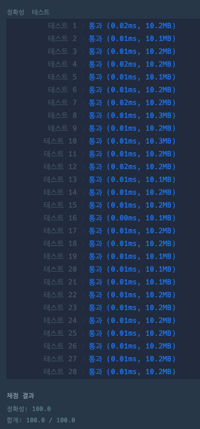

# 위장

원문 URL : https://programmers.co.kr/learn/courses/30/lessons/42578?language=python3

> 스파이들은 매일 다른 옷을 조합하여 입어 자신을 위장합니다.  

예를 들어 스파이가 가진 옷이 아래와 같고 오늘 스파이가 동그란 안경, 긴 코트, 파란색 티셔츠를 입었다면
다음날은 청바지를 추가로 입거나 동그란 안경 대신 검정 선글라스를 착용하거나 해야 합니다.

|종류|이름|
|------|---|
|얼굴|동그란 안경, 검정 선글라스|
|상의|파란색 티셔츠|
|하의|청바지|
|겉옷|긴 코|

스파이가 가진 의상들이 담긴 2차원 배열 clothes가 주어질 때  
서로 다른 옷의 조합의 수를 return 하도록 solution 함수를 작성해주세요.

## 제한사항
- clothes의 각 행은 [의상의 이름, 의상의 종류]로 이루어져 있습니다.
- 스파이가 가진 의상의 수는 1개 이상 30개 이하입니다.
- 같은 이름을 가진 의상은 존재하지 않습니다.
- clothes의 모든 원소는 문자열로 이루어져 있습니다.
- 모든 문자열의 길이는 1 이상 20 이하인 자연수이고 알파벳 소문자 또는 '_' 로만 이루어져 있습니다.
- 스파이는 하루에 최소 한 개의 의상은 입습니다.

## 입출력 예
|clothes|	                                                                                    return|
|----|----|
|[["yellowhat", "headgear"], ["bluesunglasses", "eyewear"], ["green_turban", "headgear"]]|	5|
|[["crowmask", "face"], ["bluesunglasses", "face"], ["smoky_makeup", "face"]]|	            3|

## 입출력 예 설명

- 예제 #1  
headgear에 해당하는 의상이 yellow_hat, green_turban이고 eyewear에  
해당하는 의상이 blue_sunglasses이므로 아래와 같이 5개의 조합이 가능합니다.

    1. yellow_hat
    2. blue_sunglasses
    3. green_turban
    4. yellow_hat + blue_sunglasses
    5. green_turban + blue_sunglasses


- 예제 #2  
face에 해당하는 의상이 crow_mask, blue_sunglasses, smoky_makeup이므로  
아래와 같이 3개의 조합이 가능합니다.

    1. crow_mask
    2. blue_sunglasses
    3. smoky_makeup


## Source
```python
from functools import reduce

def solution(clothes):

    t_dict = {}

    for clothe in clothes:
        if clothe[1] in t_dict:
            t_dict[clothe[1]] += 1
        else:
            t_dict[clothe[1]] = 2

    return reduce(lambda x, y: x * y, t_dict.values()) - 1
```

### description
- 경우의수에 대한 개념을 알아야한다
- (의상의종류_1의 갯수 + 1) * (의상의종류_2의 갯수 + 1) * .... (의상의종류_n의 갯수 + 1) - 1
- 마지막에 "-1"을 하는 이유는 적어도 한개의 의상이라도 입어야 하기 때문이다.

### 결과


### 다른 사람들의 풀이
- 위 문제는 경우의수 공식만 알면 쉽게 풀리는 문제라 다른 사람들의 소스도 별로 다르지 않았다.